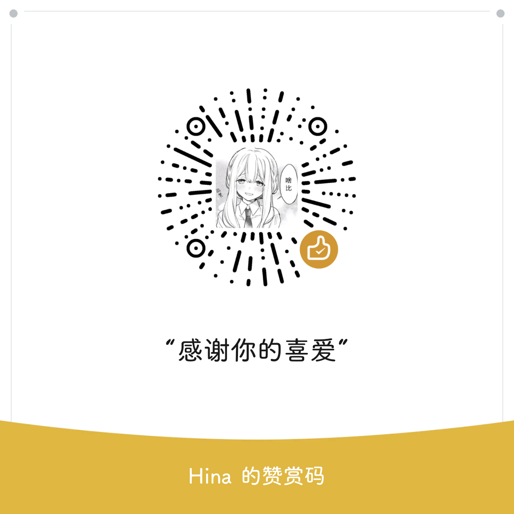

<h1 align="center" style="font-weight: bold">
  QQSyRadiant
</h1>
<p align="center">
This is a beginner's work, I hope it can help you.

  #### 加入交流群 ▷ [SyRadiant](https://t.me/SyRadiant)

  ---

## 基于本项目特殊性，请阅读该许可协议：

* [通用许可协议](https://github.com/qwq233/License/blob/master/v2/LICENSE.md)

明确以下需要特别对您说明的内容：
- 您在下载并使用本作品时均被视为已经仔细阅读本协议并完全同意。凡以任何方式使用本作品，或直接、间接使用本作品，均被视为自愿接受相关声明和用户服务协议的约束。
- 除非本协议的当事人相互以书面的方式做出相反约定，且在相关法律所允许的最大范围内，否则作者按其现状提供本作品，对本作品不作任何明示或者默示、依照法律或者其他规定的陈述或担保，包括但是不限于任何有关可否商业性使用、是否符合特定的目的、不具有潜在的或者其他缺陷、准确性或者不存在不论能否被发现的错误的担保。有些司法管辖区不允许排除前述默示保证，因此这些排除性规定并不一定适用于您。
- 用户明确并同意其使用本作品所存在的风险及法律风险将完全由其本人承担；因其使用作品而产生的一切后果也由其本人承担，本作品作者对此不承担任何责任。
- 除非书面同意，否则在任何情况下，任何作者与协议作者，或经其修改和/或传送上述程序的任何其他方均不对您承担赔偿责任，包括任何一般的，特殊的，因本作品而使您对其他法律实体造成的一切损害。本作品及作者已提前告知您此类损害的可能性。
- 请务必仔细阅读和理解通用许可协议书中规定的所有权利和限制。在使用前，您需要仔细阅读并决定接受或不接受本协议的条款。除非或直至您接受本协议的条款，否则本作品及其相关副本、相关程序代码或相关资源不得在您的任何终端上下载、安装或使用。
- 您一旦下载、使用本作品及其相关副本、相关程序代码或相关资源，即表示您同意接受本协议各项条款的约束。如您不同意本协议中的条款，您则应当立即删除本作品、附属资源及其相关源代码。
- 本协议最终解释权归本[项目作者](https://github.com/Nekozuka-Hibiki)与[协议作者](https://github.com/qwq233)所有。

## 请明确以下内容
- 项目尊重遵守[中国法律](https://baike.baidu.com/item/%E4%B8%AD%E5%8D%8E%E4%BA%BA%E6%B0%91%E5%85%B1%E5%92%8C%E5%9B%BD%E8%AE%A1%E7%AE%97%E6%9C%BA%E8%BD%AF%E4%BB%B6%E4%BF%9D%E6%8A%A4%E6%9D%A1%E4%BE%8B)，项目一切开发旨在学习研究，无任何商业行为及非法用途。
```
项目永久免费，无任何收费
基于项目特殊性及保障项目持续性的原则，请明确：
禁止二次发布二次传播
禁止二次修改、拆解内容重新打包发布传播
禁止将软件用于违法用途及商业贩卖
禁止国内平台的传播/含网盘分享
改包盗包，@#￥%&*（亲切的问候）
最终解释权归本作品作者所有
```
-  **违反四禁止将严重损害项目权益并为项目带来重大危险** 如果四禁止被违反，那么作者不会也无法追究违反者的责任，也不会要求违反者删除其传播、修改、拆解、贩卖的内容；但作者为了保障自身安全及其权益和保障项目使用者的使用体验，将在可能的情况下 **永久暂停或关闭删除项目** 
---

## 支持的功能/更新日志

<details>

- 禁止催更！！！
  
#### Latest Release ▷ [NTv1.0](https://github.com/Nekozuka-Hibiki/QQSyRadiant/releases/tag/NTv1.0)

SyRadiant 全量 PLUS 精简 LITE 净； 所有版本可互相覆盖

模块使用列表：QAuxiliary TSBattery 置入于 SyRadiant PLUS

- 全量：官方版本直接修改打入模块，当其他版本出现BUG或功能缺失时可以换用

- PLUS：

  精简内容：UE4、无用库、无用组件、无用资源、QQ直播、QQ商城、QQ小世界部分、超级QQ秀部分、主页超级QQ秀图标、腾讯地图

  删除内容：应用权限、服务与活动、日志采集、channel日志、部分后台、游戏推广、部分广告、game服务（非游戏登陆）、VIP服务（主要为VIP广告推广）

  优化内容：缓存占用、冷启动、防更新

- LITE：使用PLUS底包制作，特性与PLUS一致但没有模块附加影响和功能，具备最快的冷启动和最好的省电效率

PLUS的高速冷启动需要缓存帮助，初安装时冷启动可能缓慢至5S，正常使用一段时间后可降至1-2S，具体情况根据手机性能和系统而定；缓存至存储类非内存，清理后会失效，需重新编译

- `QQSyRadiant`项目个人维护，精力有限，更多内容可自行探索，有问题建议先尝试自行解决

项目所有安装包皆通过了华米OV四家手机厂商杀毒，额外经过Windows安全中心、腾讯、360、火绒、卡巴斯基杀毒，报告皆为安全；如果你报毒了，建议相信安全软件

</details>

---

## 赞助一杯Coffee/给作者喵喂一口猫娘/猫粮！



* [爱发电](https://afdian.net/a/SyRadiant)
- 项目完全免费，无任何性质的收费，项目不贩卖软件，所有内容均作为开发学习不进行任何商业行为。
- 由于项目的特殊性，项目不接受任何形式的赞助；该赞助方式仅针对作者进行赞助，与项目无任何关联

## 感谢
* [QAuxiliary](https://github.com/cinit/QAuxiliary)
